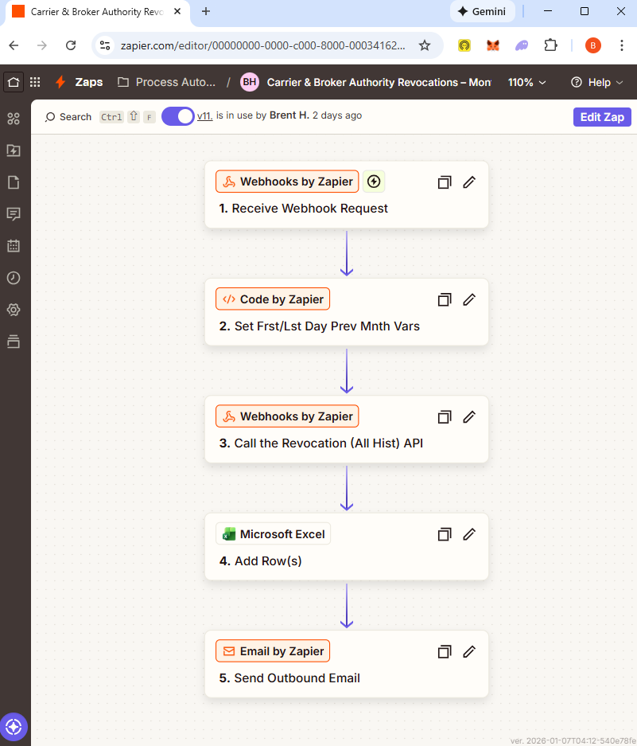

# Carrier & Broker Authority Revocations - Automated Solution

## Overview

This directory contains scripts, exploration, and options for automating data retrieval and delivery of the FMCSA Carrier & Broker Authority Revocations. The primary deliverable is an automated Python script that generates monthly Excel reports of authority revocations.

## Script Files

### Python Script
- **`Carrier & Broker Authority Revocations – Generate Monthly Report.py`** - Automated monthly report generator using the `requests` library

### PowerShell Scripts (API Exploration)
The PowerShell scripts were used for initial API exploration and data inspection:
- `01-all-revoke-hst-revocation-ordr-types.ps1` - Explore revocation order types
- `02-all-revoke-hist-sample-data.ps1` - Pull sample data
- `03-all-revoke-hist-data-no-limit.ps1` - Pull data without limits
- `04-all-revoke-hist-prv-mnthly-rcrd-cnt.ps1` - Previous monthly record counts
- `05-all-unique-revoke-hist-data.ps1` - Unique revocation history data

### Configuration
- `app_token.txt` - API authentication token (gitignored)
- `fmcsa_api_ids.json` - API endpoint identifiers

## The Solution: Monthly Report Generator

### Features
- Automatically calculates the previous month's date range
- Retrieves all carrier and broker authority revocations for that month
- Filters data on the API side using the effective date
- Handles pagination automatically (1,000 records per page)
- Exports data to a formatted Excel table with:
  - Auto-sized columns
  - Professional table styling
  - Sorted by effective date

### Requirements
```bash
pip install pandas
pip install requests
pip install openpyxl
```

### Usage
```bash
python "Carrier & Broker Authority Revocations – Generate Monthly Report.py"
```

The script will generate `Generated Report.xlsx` in the parent directory containing all revocations from the previous month.

## API Details

**Endpoint:** https://data.transportation.gov/resource/sa6p-acbp.json

**Note:** For authentication and rate limiting details, as well as the differences between the legacy view API and SODA API, see [API Token Usage Notes](API%20Token%20Usage%20Notes.md).

**Fields Retrieved:**
- `dot_number` - USDOT Number
- `docket_number` - Docket Number
- `order2_type_desc` - Revocation Type
- `type_license` - Operating Authority Registration Type
- `order1_serve_date` - Serve Date
- `order2_effective_date` - Effective Date

**Date Fields Explained:**
- **Serve Date (`order1_serve_date`):** The date when the revocation notice/order was officially served/delivered to the carrier or broker. This is when they were notified that their authority would be revoked.
- **Effective Date (`order2_effective_date`):** The date when the revocation actually takes effect and the company can no longer legally operate.

There's typically a 30-35 day gap between these dates (e.g., served 12/01/2025, effective 01/05/2026), giving companies time to wind down operations, notify customers, and potentially resolve issues.

## Development Notes

### Initial GitHub Copilot Prompt

This was the first prompt used when developing the Python solution:

```
Please generate Python code that'll pull data from the Revocation - All With History api. 
Here's the endpoint: https://data.transportation.gov/api/v3/views/sa6p-acbp/query.json?pageNumber=1&pageSize=10&app_token=$YOUR_APP_TOKEN

Get the token from app_token.txt.

However, please use the Socrata module from the sodapy lib and pandas. Here's an example:
#!/usr/bin/env python

# make sure to install these packages before running:
# pip install pandas
# pip install sodapy

import pandas as pd
from sodapy import Socrata

# Unauthenticated client only works with public data sets. Note 'None'
# in place of application token, and no username or password:
client = Socrata("data.transportation.gov", None)

# Example authenticated client (needed for non-public datasets):
# client = Socrata(data.transportation.gov,
#                  MyAppToken,
#                  username="user@example.com",
#                  password="AFakePassword")

# First 2000 results, returned as JSON from API / converted to Python list of
# dictionaries by sodapy.
results = client.get("sa6p-acbp", limit=2000)

# Convert to pandas DataFrame
results_df = pd.DataFrame.from_records(results)

Let's add a query to the query string of the request (to subset cols and filter on the effective date):
$select = "dot_number,docket_number,order2_type_desc,type_license,order1_serve_date,order2_effective_date"
$where = "order2_effective_date >= '$startDate' AND order2_effective_date <= '$endDate'"

Before making the API calls, you'll need to determine (and set variables for) the date (not datetime) 
of the first and last day of the previous month. An example format is: 12/31/2025. Parameterize those 
dates into the request query.

You'll also need to paginate every 1,000 to get the full data.

After that, let's write the dataset to Excel nicely formatted in an Excel data table. Let's call the 
workbook Generated Report.xlsx (for now) and save it to the parent directory.
```

### Technical Decisions

**Why `requests` over `sodapy`?**

After initial development with `sodapy`, we switched to `requests` for better transparency and easier debugging.

**Date Filtering Challenge:**

The API requires date filtering using a `LIKE` pattern instead of direct comparison:
```python
where_condition = f"order2_effective_date LIKE '{mm}/%/{yyyy}'"
```

This approach was more reliable than using date range comparisons with various ISO formats.

## Alternative Low-Code/No-Code Approach: Zapier Exploration

### Initial Zapier Attempt

Before developing the Python solution, I explored building this automation in Zapier to leverage its built-in scheduling and email capabilities.



**Workflow Steps:**
1. **Receive Webhook Request** - Trigger the automation (can be changed to a schedule trigger for automated monthly runs)
2. **Set First/Last Day Prev Month Vars** - Calculate date range using Code by Zapier (currently limited to a small data sample to avoid pagination and excessive task usage)
3. **Call the Revocation (All Hist) API** - Retrieve data via Webhooks by Zapier
4. **Add Row(s)** - Write to Microsoft Excel (requires an existing Excel spreadsheet in OneDrive that the Zap connects to)
5. **Send Outbound Email** - Distribute a link to the shared Excel document

### Findings

**Pros:**
- Built-in scheduling functionality
- Easy email automation and distribution
- No-code/low-code approach accessible to non-developers

**Cons (Pain Points):**
- **API Pagination** - Difficult to handle iterative API calls for large datasets
- **Excel Formatting** - Limited control over Excel table formatting and styling
- **Task Usage** - High task consumption when writing rows to Excel for large datasets
- **Overall Complexity** - More restrictive than expected, though technically doable

### Hybrid Approach Potential

A promising compromise could be:
- Use **Python** for data extraction, transformation, and Excel generation
- Embed Python code in a **Zapier Function** (provides more control over the Python environment and supports 3rd party modules like pandas, requests, openpyxl - unlike Code by Zapier)
- Leverage **Zapier** for scheduling and automated email delivery

This would combine Python's flexibility with Zapier's automation infrastructure.
